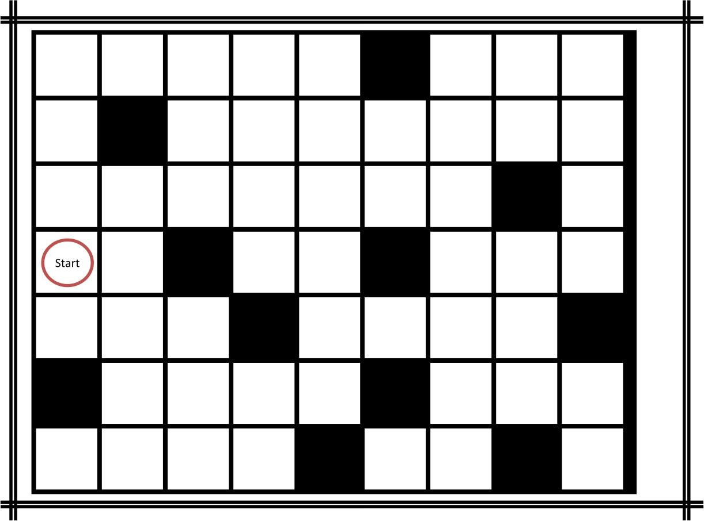

# Team-Computing-with-Robotics
Final project for DIT's Team Computing module

This repo is intended to be part of code portfolio, showcasing miscellaneous skills and achievements to potential employers. **This code is not intended for reuse.**

This repo contains code for the final assignment of Team Computing, a first year module at the Dublin Institute of Technology. The code is written in [RobotC](http://www.robotc.net/), a C variant and was run on a Lego Mindstorms NXT robot. The assignment was submitted and demonstrated on 4 April 2016.

This repo is a copy of a collaborative project between Michael Dunleavy, Jack Mc Cormack, and Eoin Feely.

The objective is to program a robot to traverse and map an irregularly checkered grid like the one in picture below.

Source code is included for individual components as well as the final submission. The final submission can be found in [Source/team3-3.c](Source/team3-3.c).

Below is an extract from the project brief:
>The challenge is to start from point (Start), move through the grid and map it, correctly marking black and white squares. You must output this map to a file – which will be checked for accuracy – correctly identifying:
* start position
* number of rows and columns
* number of white/black squares
* total number of squares on the grid

>The robot then needs to return to the start position. An object will be placed on one of the squares on the grid and the robot then needs to determine and write to a second file:
* The position of the object on the grid (the Cell number or the Row/Column)
* Whether the object is on a black or white square
